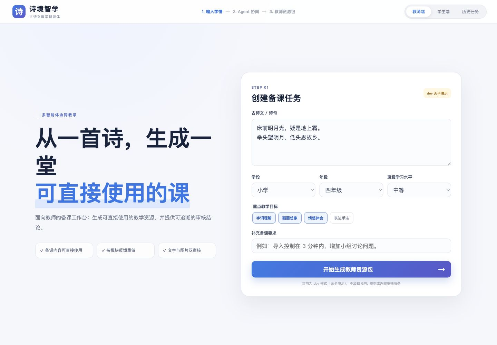
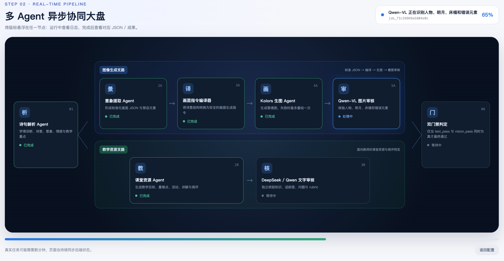
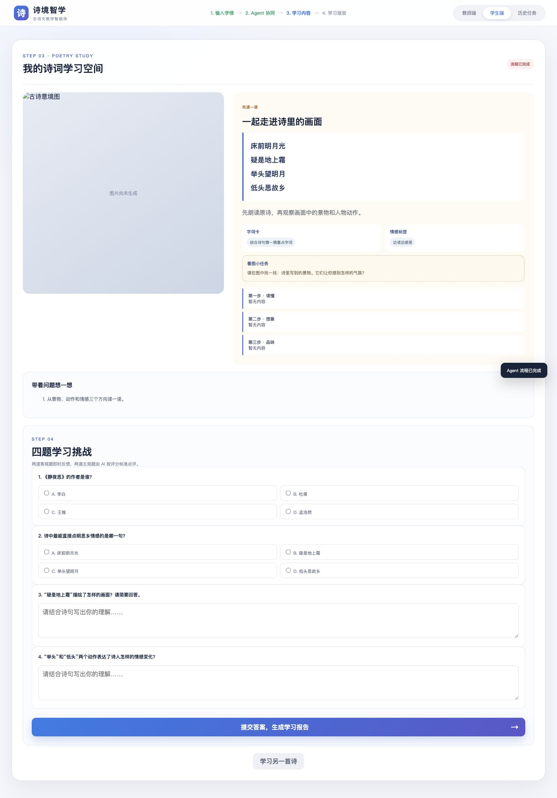
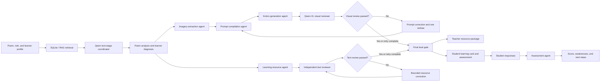

# PoetryEduAgent · Poetic Intelligence

[中文](README.md) · **English**

> A multi-agent learning system that turns classical Chinese poetry into personalized teaching resources, generated imagery, and assessable student experiences.

PoetryEduAgent coordinates retrieval, poem interpretation, lesson-resource generation, text-to-image prompting, visual generation, independent review, and student assessment in one observable workflow. It is designed for teachers preparing lessons and students learning independently, with separate quality gates for educational content and generated images.

[Overview](#overview) · [Interface](#interface) · [Capabilities](#capabilities) · [Workflow](#workflow) · [Architecture](#architecture) · [Quick start](#quick-start) · [Documentation](#documentation)

## Overview

Learning classical Chinese poetry involves more than translating individual lines. Students need to connect imagery, emotion, literary technique, historical language, and visual scenes. Teachers also need differentiated explanations, activities, questions, illustrations, and assessments for different grade levels and learning goals.

PoetryEduAgent organizes these tasks as a traceable multi-agent pipeline:

- builds a learner profile from grade level, ability, weaknesses, and learning goals;
- retrieves poem and teaching evidence from a local SQLite knowledge base;
- produces differentiated explanations, activities, and assessments;
- converts poetic imagery into structured prompts for image generation;
- reviews text and generated images independently;
- performs bounded correction when either review path fails;
- records agent events, review decisions, revisions, and learning reports.

The project emphasizes **observable orchestration, independent review, bounded correction, and educational usefulness** rather than a single model call that produces unverified content.

## Interface

### Teacher workspace



Teachers specify the poem, school stage, grade, class level, and learning objectives. The system produces lesson introductions, differentiated explanations, teaching objectives, key concepts, question chains, classroom activities, assessments, and imagery.

### Multi-agent execution workspace



The execution view separates the visual-generation branch from the teaching-resource branch. Agent states, incremental events, structured outputs, review results, and correction attempts remain inspectable throughout the task.

### Student learning and assessment



Students receive the original poem, guided interpretation, imagery observations, learning activities, and a four-question assessment. After submission, the assessment agent returns a score, question-level feedback, weaknesses, and next-step recommendations.

## Capabilities

### Personalized poem understanding

- learner profiles based on grade, ability, weaknesses, and goals;
- SQLite/RAG retrieval for poem and teaching evidence;
- plain-language interpretation, key vocabulary, imagery, emotional evidence, and literary techniques;
- role-aware output for teachers and students.

### Teaching and self-study resources

- lesson introductions, differentiated explanations, objectives, key concepts, question chains, and activities;
- student-friendly guidance, reflection prompts, and independent learning tasks;
- two objective questions and two rubric-based subjective questions;
- targeted revisions based on teacher feedback.

### Poetic image generation

- structured scene representation covering subject, action, composition, focus, light, mood, style, and prohibited elements;
- deterministic prompt compilation for Kolors;
- saved generation metadata including seed, dimensions, sampling steps, and guidance scale;
- limited automatic redraw when visual review identifies a mismatch.

### Independent review and correction

- Qwen-VL checks visible elements and visual errors from the generated image itself;
- DeepSeek-V4-Flash independently reviews knowledge, interpretation, pedagogy, questions, and rubrics;
- local Qwen provides a text-review fallback when the external reviewer is unavailable;
- text and visual review results are combined only at the final dual gate;
- failed branches receive at most one bounded correction attempt.

### Assessment and persistence

- deterministic scoring for objective questions;
- rubric-based scoring for subjective responses;
- question-level feedback, weakness analysis, and personalized next steps;
- persistent tasks, agent events, generated resources, review records, teacher feedback, and learning reports;
- incremental event queries and Server-Sent Events for live status updates.

## Workflow



The visual and educational branches share the poem, learner profile, retrieval evidence, and poem interpretation. The structured image prompt is used only by the visual branch and is deliberately excluded from the independent text review.

## Architecture

| Layer | Technology and responsibility |
| --- | --- |
| Web interface | HTML, CSS, JavaScript; teacher, student, execution, and history views |
| API | FastAPI and Pydantic; task submission, status, SSE, results, and feedback |
| Retrieval and data | SQLite and RAG; versioned knowledge assets and a separate runtime database |
| Text understanding | Qwen2.5-14B-Instruct-AWQ |
| Text review | DeepSeek-V4-Flash with local Qwen fallback |
| Image generation | Kolors with structured prompt compilation |
| Visual review | Qwen2.5-VL |
| Orchestration | Multi-agent workflow, isolated model processes, and single-GPU scheduling |
| Quality control | JSON Schema, semantic guards, independent review paths, and bounded correction |
| Persistence | Tasks, events, resources, images, reviews, feedback, and assessments |

## Repository structure

```text
PoetryEduAgent/
├── backend/
│   ├── agents/             # Text-stage and prompt-compilation logic
│   ├── api/                # FastAPI routes
│   ├── generation/         # Image-generation client
│   ├── model_clients/      # Qwen, DeepSeek, and Qwen-VL clients
│   ├── model_runtime/      # Isolated model processes and scheduling
│   ├── orchestration/      # Multi-agent workflow
│   ├── rag/                # SQLite retrieval
│   └── storage/            # Database schema and repositories
├── frontend/static/        # Web interface
├── assets/screenshots/     # Public interface screenshots
├── data/examples/          # Public API and assessment examples
├── docs/                   # Architecture and integration documentation
├── environments/           # Isolated GPU dependency specifications
├── scripts/                # Setup, launch, validation, and data utilities
├── tests/                  # API, workflow, database, and interface tests
├── .env.example
├── requirements-dev.txt
└── requirements-gpu.txt
```

## Quick start

The development mode demonstrates the main product flow without local GPU models or an external review service.

```bash
git clone https://github.com/7ianostalgia/PoetryEduAgent.git
cd PoetryEduAgent
bash scripts/setup_dev.sh
cp .env.example .env
python scripts/initialize_database.py
bash scripts/start_dev.sh
```

Open:

- Application: <http://localhost:7860>
- API documentation: <http://localhost:7860/docs>
- Health check: <http://localhost:7860/api/health>
- Runtime configuration: <http://localhost:7860/api/config>

### GPU mode

GPU mode expects isolated environments for the main service, Qwen, Kolors, and Qwen-VL. The setup script creates or reuses the required environments:

```bash
bash scripts/setup_gpu.sh
cp .env.example .env
```

Set `RUN_MODE=gpu` and configure the model and data paths in `.env`:

| Variable | Purpose |
| --- | --- |
| `POETRY_DB_PATH` | Local poem and teaching knowledge base |
| `POETRY_RUNTIME_DB_PATH` | Runtime tasks, resources, reviews, and reports |
| `OUTPUT_DIR` | Generated images and task outputs |
| `LOCAL_LLM_MODEL` | Qwen2.5-14B-Instruct-AWQ path |
| `KOLORS_MODEL` | Kolors model path |
| `VISION_MODEL` | Qwen2.5-VL model path |
| `DEEPSEEK_API_KEY` | Optional independent text reviewer |

Validate configuration and start the service:

```bash
.venv/bin/python scripts/check_env.py --mode gpu
bash scripts/start_gpu.sh
```

## Validation

The automated suite covers the API, database, retrieval, model clients, workflow, correction logic, assessment, and interface structure without requiring the GPU models to load:

```bash
.venv/bin/pytest
```

## Current limitations

- GPU generation is sequential and is not designed for high-concurrency production traffic.
- The public poem-task API currently uses *Quiet Night Thought* as the fixed demonstration case.
- Some visual constraints remain tailored to the demonstration poem and require broader rules for additional genres and scenes.
- Model output passes structural checks and independent review, but teachers should still apply professional judgment.

## Roadmap

- broaden poem coverage and teaching-knowledge retrieval;
- generalize visual review across subjects, people, scenes, and poetic genres;
- add longitudinal learner profiles and mistake analysis;
- improve resource editing, comparison, and rollback;
- extend teacher and student feedback loops;
- add task cancellation, quotas, concurrent scheduling, and deployment monitoring;
- publish additional reproducible examples and demonstration media.

## Documentation

- [Documentation hub](docs/README.md)
- [API contract](docs/API.md)
- [GPU workflow](docs/GPU_WORKFLOW.md)
- [Text-agent stage](docs/TEXT_STAGE.md)
- [Agent state and data boundaries](docs/AGENT_STATE.md)
- [Database schema](docs/DATABASE_SCHEMA.md)
- [Model manager](docs/MODEL_MANAGER.md)
- [Qwen AWQ integration](docs/QWEN_AWQ_INTEGRATION.md)
- [Kolors integration](docs/KOLORS_INTEGRATION.md)
- [Qwen-VL integration](docs/QWEN_VL_INTEGRATION.md)
- [DeepSeek review integration](docs/DEEPSEEK_REVIEW.md)
- [Development guide](docs/DEVELOPMENT.md)

## Responsible use

PoetryEduAgent is an engineering and research project for classical Chinese poetry education. Generated explanations, questions, scores, and images may be affected by model limitations and input quality. They should support—not replace—a teacher's professional judgment.
