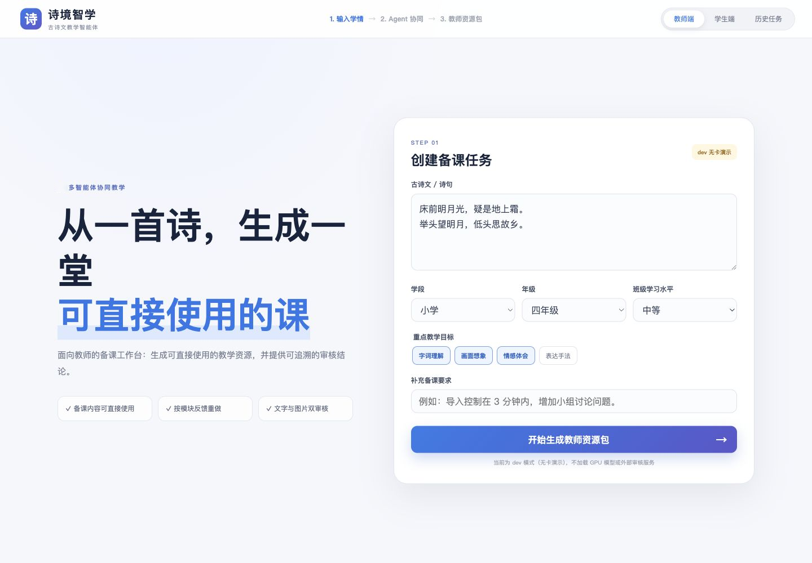
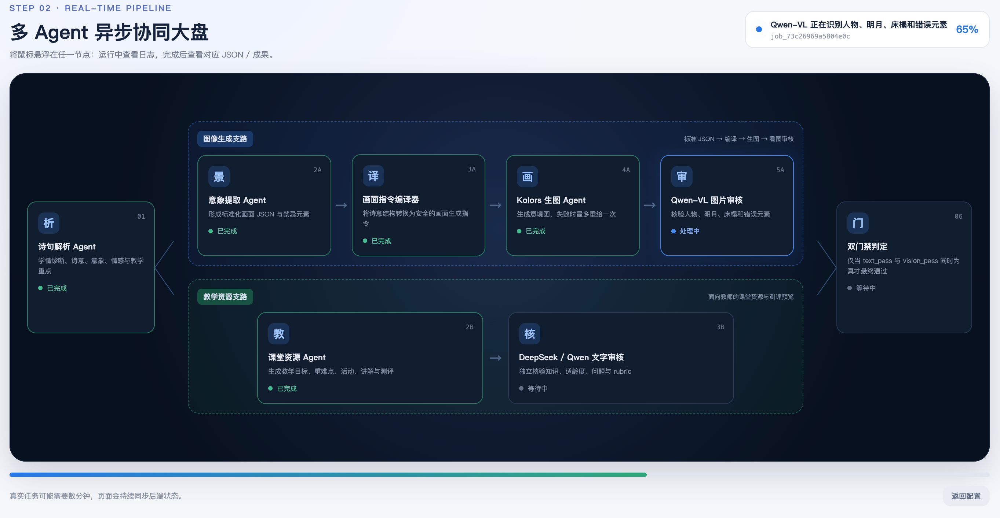
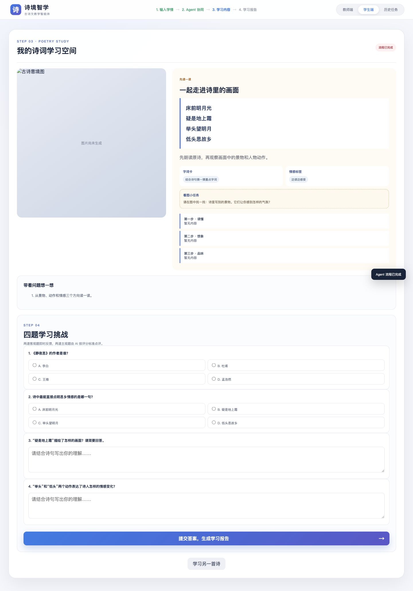
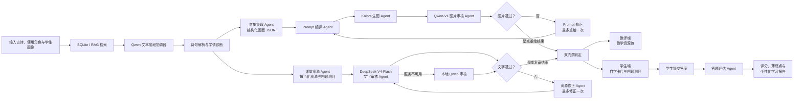

# PoetryEduAgent · 诗境智学

面向古诗文教学场景的多 Agent 个性化学习资源生成系统，通过诗词理解、图文生成、双重审核与答题评估，辅助教师备课并支持学生自主学习。

[示例输入与输出](#示例输入与输出) · [核心功能](#核心功能) · [工作流程](#系统工作流程) · [技术架构](#技术架构) · [本地运行](#本地运行) · [项目文档](#项目文档)

## 项目背景与目标

古诗文学习不仅要求学生理解字词和诗句，还需要建立意象、情感、表达手法与具体画面之间的联系。教师在备课时，往往还需要根据年级、能力层次和学习薄弱点，重复整理讲解、问题链、课堂活动、配图和测评题。

PoetryEduAgent（诗境智学）尝试将这些工作组织为一条可观察、可审核、可纠偏的多 Agent 协同流程：

- 根据学生画像和本地诗词知识生成分层学习资源；
- 通过意境图帮助学生建立诗句、意象和情感之间的联系；
- 同时审查文字内容与生成图片，降低知识错误和画面偏差；
- 面向教师输出可用于备课的教学资源包；
- 面向学生提供自学卡片、四题测评和个性化学习报告；
- 保留 Agent 事件、审核结果和历史任务，便于追踪生成过程。

项目重点关注 **多 Agent 协同、个性化学习资源生成、古诗文理解能力培养、审查纠偏机制**，而不是单纯调用模型生成一段讲解或一张图片。

## 示例输入与输出

以下示例直接截取自项目网页端，分别展示任务输入、多 Agent 执行过程和学生学习输出。

### 示例输入：教师备课任务



教师端根据诗词、学段、年级、班级水平和教学目标创建任务，最终生成课堂导入、分层讲解、重点难点、问题链、课堂活动、测评与意境图。

### 执行过程：多 Agent 协同大盘



大盘按图像生成支路和教学资源支路展示 Agent 状态、执行日志与结构化成果，并在两个审核支路结束后进行双门禁判定。

### 示例输出：学生自主学习与测评



学生端将原诗、意境观察、分步理解和四题测评组织在同一学习空间。提交答案后，答题评估 Agent 生成评分、薄弱点与个性化学习报告。

> 教师端与学生端截图由本地可重复测试流程生成，用于展示页面结构；Agent 大盘截图来自 gpu 模式任务运行过程。

## 核心功能

### 个性化诗词理解

- 根据年级、能力水平、薄弱点、学习目标和补充要求建立学生画像；
- 从 SQLite 诗词知识库检索相关诗词与教学证据；
- 生成白话释义、重点字词、核心意象、情感证据、表达手法和学习重点；
- 根据教师端或学生端角色调整资源语言、深度和组织方式。

### 教学资源与自主学习资源

- 教师端生成课堂导入、分层讲解、教学目标、重点难点、问题链和课堂活动；
- 学生端生成适龄自学导语、由浅入深的讲解、思考提示和学习活动；
- 固定生成 2 道客观题和 2 道主观题，主观题附带评分 rubric；
- 教师可针对指定资源模块提交反馈并进行定向修订。

### 古诗意境图生成

- 将诗句分析转化为结构化画面 JSON；
- 明确场景、人物、动作、构图、视觉重点、光线、情绪、风格和禁止元素；
- 通过 Prompt 编译器生成 Kolors 可执行的中文提示词与负面提示词；
- 保存图片、随机种子、尺寸、采样步数等生成记录。

### 审查与纠偏

- Qwen-VL 客观检查人物数量、明月、床榻、月光和错误元素；
- DeepSeek-V4-Flash 独立审核知识、释义、教学设计、测评题和 rubric；
- DeepSeek-V4-Flash 不可用时由本地 Qwen 执行文字审核；
- 图片未通过时，根据实际看图结果修正结构化 Prompt，并最多自动重绘一次；
- 只有 `text_pass` 与 `vision_pass` 同时成立，最终双门禁才判定通过。

### 学生答题评估

- 客观题由确定性规则判断正误；
- 主观题由 Qwen 按 rubric 评分；
- 汇总客观题与主观题得分；
- 输出薄弱点、逐题反馈和下一步学习建议；
- 将学生答案与学习报告持久化到 SQLite。

### 过程可视化与持久化

- 前端展示多 Agent 实时协同大盘；
- 支持增量事件查询与 SSE 状态流；
- 任务、Agent 事件、生成资源、审核记录、教师反馈和测评报告写入运行数据库；
- 服务重启后仍可查询并重新打开历史任务。

## 系统工作流程



当前文本阶段采用一次 Qwen 模型加载，同时完成学情诊断、诗句解析、课堂资源生成、测评题生成和结构化画面描述等逻辑职责。前端大盘中的 Agent 表示清晰的业务职责和输出边界，不完全对应独立的模型进程。

意象提取 Agent 输出的 `standard_prompt_json` 只进入图像生成支路；课堂资源 Agent 不以该画面 JSON 作为输入。两条支路共享的是古诗原文、学生画像、RAG 证据和诗句理解结果。

## 技术架构

| 层级 | 技术与职责 |
| --- | --- |
| Web 前端 | HTML、CSS、JavaScript；教师端、学生端、Agent 大盘与历史任务 |
| API 后端 | FastAPI、Pydantic；任务提交、状态查询、SSE、结果与反馈接口 |
| 数据与检索 | SQLite、RAG；诗词知识库与独立运行数据库 |
| 文本理解 | Qwen2.5-14B-Instruct-AWQ；学情诊断、诗句解析、资源与测评生成 |
| 文字审核 | DeepSeek-V4-Flash；不可用时回退至本地 Qwen |
| 图像生成 | Kolors、结构化 Prompt 编译器 |
| 图像审核 | Qwen2.5-VL；基于实际图片进行元素识别与问题报告 |
| 任务编排 | 多 Agent 工作流、单 GPU 互斥、独立模型子进程 |
| 质量控制 | JSON Schema、语义护栏、文字/图片双门禁、有限次数纠偏 |
| 持久化 | 任务、事件、资源、图片记录、审核、反馈、答题与学习报告 |

知识库与运行库相互独立：

- `data/poetry_edu.db`：可版本化的诗词与教学知识资产；
- `POETRY_RUNTIME_DB_PATH`：gpu 任务、学生画像、模型结果、反馈和测评记录。

## 多 Agent 设计

### 1. 诗句解析 Agent

读取古诗、学生画像和 RAG 证据，输出学情诊断、白话释义、重点字词、意象、情感证据、表达手法、教学重点与风险提示。

### 2. 意象提取 Agent

将诗意转换为结构化画面描述 `standard_prompt_json`，主要字段包括：

```text
scene / subject / action / composition / visual_focus
light / emotion / style / avoid / composition_constraints
```

该结果服务于图像生成，不直接传入课堂资源 Agent。

### 3. Prompt 编译 Agent

把结构化画面 JSON 转换为 Kolors 中文 Prompt 和负面 Prompt，避免由自然语言自由拼接造成关键约束丢失。

### 4. Kolors 生图 Agent

根据编译后的 Prompt 生成古诗意境图，并记录图片路径、尺寸、随机种子、采样步数和引导系数。

### 5. Qwen-VL 图片审核 Agent

只依据实际图片检查关键元素与错误元素，不根据原始 Prompt 猜测图片内容。审核失败时，其观察结果会成为 Prompt 修正依据。

### 6. 课堂资源 Agent

根据使用角色生成教师备课资源或学生自主学习资源，同时生成两道客观题和两道带 rubric 的主观题。

### 7. 文字审核 Agent

由 DeepSeek-V4-Flash 独立检查知识准确性、适龄性、教学设计、问题链、测评题和 rubric。DeepSeek-V4-Flash 不可用时使用本地 Qwen 审核。

文字审核输入会主动移除图像 Prompt 和视觉结果，避免文字质量判断受到生图内容干扰。

### 8. 双门禁判定模块

汇总文字与图片审核结果：

```text
final_pass = text_pass && vision_pass
```

任务完成不等于审核通过，前端会分别显示文字门禁、图片门禁和最终结论。

### 9. 答题评估 Agent

学生完成自学卡片中的四题测评后触发。客观题使用确定性规则判定，主观题由 Qwen 按 rubric 评分，最终生成得分、薄弱点和下一步学习建议。

## 教师端与学生端

| 能力 | 教师端 | 学生端 |
| --- | --- | --- |
| 使用目标 | 辅助备课与课堂设计 | 支持自主理解与练习 |
| 内容语气 | 专业、可执行的教学表达 | 适龄、亲切的学习表达 |
| 主要资源 | 课堂导入、分层讲解、教学目标、重点难点、问题链、课堂活动 | 自学导语、分步讲解、学习目标、思考提示、自主学习活动 |
| 意境图 | 用于课堂展示和意象讲解 | 用于观察画面、联系诗句与情感 |
| 测评 | 查看题目、答案与 rubric | 完成 2 道客观题和 2 道主观题 |
| 反馈闭环 | 可对指定模块提交教师反馈并定向修订 | 答题评估 Agent 生成评分与学习报告 |
| 历史记录 | 查看并重新打开教师任务 | 查看自学任务与既有学习报告 |

## 项目目录结构

```text
PoetryEduAgent/
├── backend/
│   ├── agents/             # 文本阶段与 Prompt 编译逻辑
│   ├── api/                # FastAPI 路由
│   ├── generation/         # Kolors 生成客户端
│   ├── model_clients/      # Qwen、DeepSeek-V4-Flash、Qwen-VL 客户端
│   ├── model_runtime/      # 模型进程与单 GPU 调度
│   ├── orchestration/      # 多 Agent 工作流与服务编排
│   ├── rag/                # SQLite 检索
│   └── storage/            # 数据库结构与持久化仓库
├── frontend/static/        # 教师端、学生端与 Agent 大盘
├── assets/screenshots/     # README 项目界面截图
├── data/
│   ├── examples/           # API 请求与答题示例
│   └── poetry_edu.db       # 可公开的诗词知识库
├── docs/                   # 架构、API、数据库与模型接入文档
├── environments/          # 三个隔离 GPU 模型环境依赖
├── scripts/               # 安装、启动、检查与数据工具
├── tests/                 # API、工作流、数据库与前端测试
├── .env.example
├── requirements-dev.txt   # 主服务与 dev 模式依赖
└── requirements-gpu.txt   # gpu 环境结构说明，不直接安装
```

## 本地运行

项目只提供两种运行模式：

| 模式 | `RUN_MODE` | 适用场景 |
| --- | --- | --- |
| dev 模式 | `dev` | 无卡演示；不要求本地模型或 DeepSeek-V4-Flash Key |
| gpu 模式 | `gpu` | 已准备 Qwen、Kolors 与 Qwen-VL；DeepSeek-V4-Flash Key 可选 |

```bash
git clone https://github.com/7ianostalgia/PoemEduAgents.git
```

```bash
cd PoetryEduAgent
```

### 方式一：dev 模式

安装主服务与 dev 依赖：

```bash
bash scripts/setup_dev.sh
```

创建配置：

```bash
cp .env.example .env
```

启动：

```bash
bash scripts/start_dev.sh
```

启动后访问：

- Frontend：<http://localhost:7860>
- Backend：<http://localhost:7860>
- API Docs：<http://localhost:7860/docs>
- Health：<http://localhost:7860/api/health>
- Config：<http://localhost:7860/api/config>

dev 模式不加载 GPU 模型或外部审核服务，但可以运行任务创建、进度查询、结构化结果、四题测评和前端主要流程。

### 方式二：gpu 模式

gpu 模式使用四个隔离环境，避免不同模型要求的 PyTorch、Transformers 和 Diffusers 版本互相冲突：

| 环境 | 依赖文件 | 安装方式 |
| --- | --- | --- |
| 主服务 `.venv` | `requirements-dev.txt` | `setup_gpu.sh` 自动安装 |
| Qwen | `environments/qwen14b-awq.txt` | 独立 Conda 环境 |
| Kolors | `environments/kolors.txt` | 独立 Conda 环境 |
| Qwen-VL | `environments/qwen-vl.txt` | 独立 Conda 环境 |

`requirements-gpu.txt` 只说明 gpu 依赖结构，不应直接执行 `pip install -r requirements-gpu.txt`。

推荐一键创建或复用全部环境：

```bash
bash scripts/setup_gpu.sh
```

如需手动安装，每个环境分别执行：

```bash
python3 -m venv .venv
```

```bash
.venv/bin/python -m pip install -r requirements-dev.txt
```

```bash
conda create -n poetryedu-qwen14b-awq python=3.10 -y
```

```bash
conda run -n poetryedu-qwen14b-awq python -m pip install -r environments/qwen14b-awq.txt
```

```bash
conda create -n poetryedu-kolors python=3.10 -y
```

```bash
conda run -n poetryedu-kolors python -m pip install -r environments/kolors.txt
```

```bash
conda create -n poetryedu-qwen-vl python=3.10 -y
```

```bash
conda run -n poetryedu-qwen-vl python -m pip install -r environments/qwen-vl.txt
```

创建配置：

```bash
cp .env.example .env
```

在 `.env` 中将 `RUN_MODE` 设为 `gpu`，并配置：

| 配置 | 说明 |
| --- | --- |
| `HOST` / `PORT` | 默认 `0.0.0.0` / `7860` |
| `POETRY_DB_PATH` | 诗词知识库路径 |
| `POETRY_RUNTIME_DB_PATH` | gpu 任务运行数据库路径 |
| `OUTPUT_DIR` | 图片与任务结果目录 |
| `LOCAL_LLM_MODEL` | Qwen2.5-14B-Instruct-AWQ 路径 |
| `KOLORS_MODEL` | Kolors-diffusers 路径 |
| `VISION_MODEL` | Qwen2.5-VL-7B-Instruct 路径 |
| `DEEPSEEK_API_KEY` | 可选；未配置时由本地 Qwen 执行文字审核 |

检查配置：

```bash
.venv/bin/python scripts/check_env.py --mode gpu
```

启动：

```bash
bash scripts/start_gpu.sh
```

GPU/CUDA 与 PyTorch 组合可能因服务器驱动不同而需要调整；模型依赖必须继续保持三个环境隔离。

### 验证项目

```bash
.venv/bin/pytest
```

自动化测试验证 API、数据库、RAG、模型客户端、gpu 工作流、审查纠偏、答题评分和前端结构，不要求加载 GPU 模型。

## 服务器运行

服务器默认使用 gpu 模式和 `7860` 端口。

拉取代码：

```bash
git pull --ff-only origin main
```

安装或复用环境：

```bash
bash scripts/setup_gpu.sh
```

创建配置：

```bash
cp .env.example .env
```

编辑 `.env`，设置 `RUN_MODE=gpu`、模型路径、数据库路径和输出目录；如有 DeepSeek-V4-Flash Key，再配置 `DEEPSEEK_API_KEY`。

检查环境：

```bash
.venv/bin/python scripts/check_env.py --mode gpu
```

前台启动：

```bash
bash scripts/start_gpu.sh
```

后台运行：

```bash
mkdir -p logs
```

```bash
nohup bash scripts/start_gpu.sh > logs/server.log 2>&1 &
```

查看日志：

```bash
tail -f logs/server.log
```

停止服务：

```bash
kill "$(lsof -ti:7860)"
```

云服务器需要在安全组或防火墙中放行 TCP `7860`。如果服务器只用于无卡展示，可改用 `bash scripts/start_dev.sh`。

## 常见问题

### Python 版本不符合要求

`setup_dev.sh` 和 `setup_gpu.sh` 要求 Python 3.10 或更高版本，并会在安装前检查。

### `.env` 不存在

```bash
cp .env.example .env
```

### 端口 7860 被占用

```bash
lsof -i:7860
```

停止占用进程，或在 `.env` 中修改 `PORT`。

### gpu 模式启动前报模型路径错误

按错误提示修正 `.env` 中对应的 `LOCAL_LLM_MODEL`、`KOLORS_MODEL` 或 `VISION_MODEL`。检查脚本不会等到模型加载后才报告路径错误。

### DeepSeek-V4-Flash Key 未配置

dev 模式不使用 Key。gpu 模式仍可启动，并自动使用本地 Qwen 完成文字审核；`/api/health` 中的 `deepseek_configured` 会返回 `false`。

### dev 与 gpu 的区别

dev 用固定、可重复的结构化资源验证产品流程；gpu 执行 SQLite/RAG、Qwen、Kolors、Qwen-VL、DeepSeek-V4-Flash、纠偏与双门禁链路。

## 当前项目状态

截至 2026 年 6 月，项目已完成：

- 教师端与学生端 Web 界面；
- FastAPI 异步任务、状态查询、SSE 与历史任务接口；
- SQLite 诗词知识库、RAG 检索和独立运行数据库；
- Qwen 结构化文本阶段与角色化学习资源生成；
- Kolors Prompt 编译与单图生成；
- Qwen-VL 图片审核与最多一次自动纠偏重绘；
- DeepSeek-V4-Flash 文字审核与本地 Qwen fallback；
- 文字、图片双门禁；
- 教师反馈定向修订；
- 学生四题测评、主观题 rubric 评分与学习报告；
- Agent 事件、资源、审核、反馈和测评结果持久化；
- 前端多 Agent 协同大盘与历史结果恢复。

适用范围与限制：

- gpu 生成链路以单张 GPU 顺序执行，不面向高并发生产场景；
- 当前公开 API 的诗词任务入口仍以《静夜思》为固定案例；
- 部分视觉硬约束针对当前示范诗词设计，扩展到更多诗词时需要继续完善通用审查规则；
- 模型输出经过结构校验、语义护栏和审核，但仍应由教师结合具体教学场景复核；

## 后续计划

- 扩展公开 API 支持的诗词范围与教学知识覆盖；
- 建立适用于不同题材、人物和场景的通用视觉审查规则；
- 增强长期学情记录、错题归因和学习进展分析；
- 支持更细粒度的教师资源编辑、版本比较与回退；
- 完善多轮教师反馈与学生学习反馈闭环；
- 增加任务取消、资源配额、并发调度和部署监控能力；
- 补充项目截图、演示视频和可公开复现的示例结果。

## 项目文档

- [文档中心](docs/README.md)
- [API 契约](docs/API.md)
- [gpu 工作流](docs/GPU_WORKFLOW.md)
- [文本 Agent 阶段](docs/TEXT_STAGE.md)
- [Agent 状态与数据边界](docs/AGENT_STATE.md)
- [数据库设计](docs/DATABASE_SCHEMA.md)
- [数据库迁移规则](docs/MIGRATION_MAPPING.md)
- [模型调度](docs/MODEL_MANAGER.md)
- [Qwen AWQ 接入](docs/QWEN_AWQ_INTEGRATION.md)
- [Kolors 接入](docs/KOLORS_INTEGRATION.md)
- [Qwen-VL 接入](docs/QWEN_VL_INTEGRATION.md)
- [DeepSeek-V4-Flash 审核](docs/DEEPSEEK_REVIEW.md)
- [开发说明](docs/DEVELOPMENT.md)

## 使用说明

PoetryEduAgent 是面向古诗文教学研究与应用展示的工程项目。生成的讲解、题目、评分和图片可能受到模型能力与输入质量影响，不应替代教师的专业判断。
