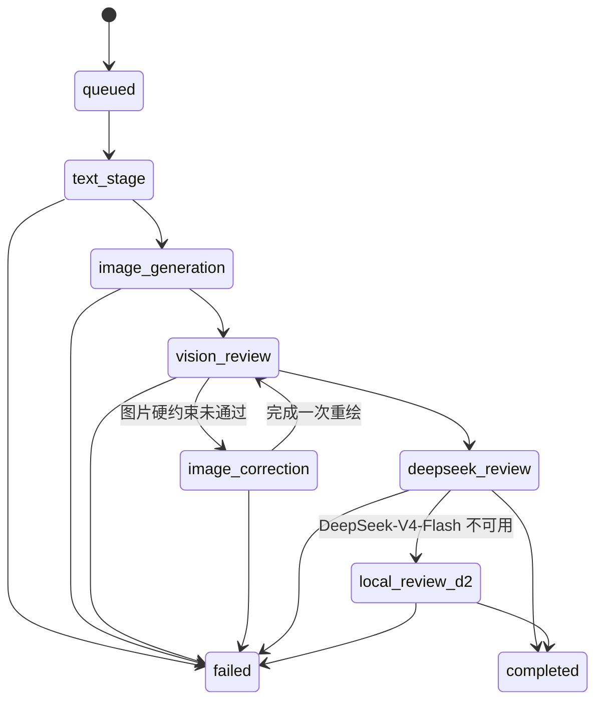

# Agent 与任务状态

本文说明 PoetryEduAgent 对“任务阶段”和“Agent 状态”的建模方式。二者用于不同目的：任务阶段描述整条工作流进度，Agent 状态描述前端协同大盘中的业务节点。

## 任务状态机

gpu 模式任务按以下阶段推进：



| 阶段 | 含义 |
| --- | --- |
| `queued` | 任务已创建，等待后台工作流处理 |
| `text_stage` | RAG 检索与 Qwen 结构化文本阶段 |
| `image_generation` | Prompt 编译与 Kolors 生图 |
| `vision_review` | Qwen-VL 看图与确定性图片门禁 |
| `image_correction` | 根据视觉问题修正 Prompt 并执行唯一一次重绘 |
| `deepseek_review` | DeepSeek-V4-Flash 文字教学质量审核 |
| `local_review_d2` | DeepSeek-V4-Flash 不可用时的本地 Qwen 审核 |
| `completed` | 工作流已结束，结果可查询 |
| `failed` | 工作流异常终止，任务保存可读错误信息 |

`completed` 只表示流程执行完成，不能替代最终双门禁中的 `pass`。

代码还保留 `analyzing`、`generating_resources` 和 `generating_quiz` 等 dev 阶段，用于无卡演示和旧接口，不代表 gpu 链路会逐一经过这些阶段。

## 逻辑 Agent

协同大盘展示八个生成阶段节点：

| Agent ID | 展示名称 | 分支 | 主要输出 |
| --- | --- | --- | --- |
| `poem_analysis` | 诗句解析 Agent | text | 学情诊断、诗句解析 |
| `image_prompt` | 意象提取 Agent | image | `standard_prompt_json` |
| `prompt_compiler` | Kolors Prompt 编译器 | image | 中文 Prompt、负面 Prompt |
| `kolors` | Kolors 生图 Agent | image | 图片路径与生成参数 |
| `vision_reviewer` | Qwen-VL 图片审核 Agent | image | 图片观察与门禁结果 |
| `text_resources` | 课堂资源 Agent | text | 角色化资源与四题测评 |
| `text_reviewer` | 文字审核 Agent | text | DeepSeek-V4-Flash 或 Qwen 审核结果 |
| `final_gate` | 双门禁判定模块 | gate | 文字、图片和最终通过状态 |

学生端答题评估 Agent 在生成流程完成、学生提交答案后触发，因此不属于上述八个生成阶段节点。

## Agent 运行状态

每个节点使用以下状态：

- `waiting`：尚未开始；
- `running`：正在处理；
- `completed`：已产生结构化结果；
- `failed`：所在阶段异常终止。

`GET /api/learning/jobs/{job_id}/agents` 会结合任务事件和最终结果返回每个节点的状态、脱敏日志与可公开结构化输出。

## 事件流

每条持久化事件包含：

```json
{
  "id": 42,
  "job_id": "job_xxx",
  "stage": "vision_review",
  "agent_id": "vision_reviewer",
  "status": "running",
  "message": "Qwen-VL 正在识别关键元素",
  "output": null,
  "created_at": "2026-06-22T08:00:00+00:00"
}
```

事件可通过普通增量接口或 SSE 获取。客户端可使用 `after_id` 或 `Last-Event-ID` 在断线后继续读取。

## 数据边界

- 任务状态、事件和结果由 SQLite 运行库持久化；
- `output` 只返回业务结果，不返回系统提示词、模型思维链或密钥；
- 图片通过受限接口读取，路径必须位于 `OUTPUT_DIR`；
- 文字审核与图片审核拥有独立输入，避免审核维度互相污染；
- 教师反馈保存原文、目标模块、旧值、Agent 输入证据和新值。

## 错误语义

- 未知任务：`404`；
- 结果、测评或报告尚未准备：`409`；
- 请求字段、题目数量或题号不合法：`422`；
- 模型或工作流异常：任务进入 `failed`，并返回经过整理的可读错误。
