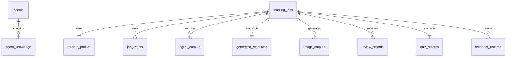

# SQLite 数据设计

PoetryEduAgent 使用两份职责不同的 SQLite 数据库：一份保存可版本化的诗词知识，一份保存实际运行产生的任务与学习记录。

## 数据库分工

| 数据库 | 配置 | 用途 |
| --- | --- | --- |
| 诗词知识库 | `POETRY_DB_PATH` | 诗词、教学知识、来源追溯与迁移记录 |
| 运行数据库 | `POETRY_RUNTIME_DB_PATH` | 学生画像、任务、事件、生成结果、审核、反馈与测评 |

默认知识库位于 `data/poetry_edu.db`。运行数据库可放在任意持久化目录，由服务启动配置决定。

## 关系概览



## 知识与迁移表

### `schema_migrations`

记录已应用的 Schema 版本和时间。

### `migration_runs`

记录每次旧库迁移的来源路径、SHA256、完整性结果、处理数量、跳过表和迁移报告。

### `legacy_raw`

按来源哈希、表名和主键保存知识类旧数据原始行，用于追溯与审计。

### `poems`

保存规范化诗词：

- 标题、作者、朝代、正文；
- 规范化标题、作者和正文；
- 标签；
- 来源数据库哈希、表名和主键；
- 创建与更新时间。

检索优先使用规范化正文，其次使用标题与作者。

### `poem_knowledge`

保存与诗词关联的教学知识，包括：

```text
translation
theme
imagery
classroom_explanation
realistic_prompt
ink_prompt
excerpt
tags
```

每条记录保留来源哈希、来源表和来源主键，可通过 `legacy_raw` 反查原始证据。

### `question_templates`

预留的题目模板表，包含题型、目标能力、难度、模板和示例。

## 运行表

### `student_profiles`

保存年级、能力层次、薄弱点、学习目标、偏好和前测信息。

### `learning_jobs`

保存任务角色、诗词输入、当前阶段、进度、状态消息、错误和时间戳。

### `job_events`

保存 Agent 事件流：

- 工作流阶段；
- Agent ID；
- 事件状态；
- 用户可读消息；
- 可选结构化输出。

事件 ID 单调递增，支持普通增量读取和 SSE 断点续传。

### `agent_outputs`

保存文本阶段、Prompt 编译等结构化 Agent 输出。完整结果之外保留该表，便于按 Agent 查询和展示。

### `generated_resources`

每个任务保存一份最终学习资源快照，包括文字、图片、审核和门禁信息。

### `image_outputs`

保存图片路径、读取 URL、Prompt、负面 Prompt、随机种子和视觉审核结果。

### `review_records`

保存本地初审、DeepSeek-V4-Flash 或 Qwen 文字审核、Qwen-VL 图片审核与最终门禁。

### `quiz_records`

保存四题结构、学生答案、分数、薄弱点和完整学习报告。

### `feedback_records`

保存教师定向反馈：

- 目标模块；
- 教师原文；
- 修订前内容；
- 资源修订 Agent 输入证据；
- 修订后模块。

## 初始化与升级

应用创建 `SqliteLearningRepository` 时会执行幂等 Schema 初始化：

```bash
python scripts/initialize_database.py
```

初始化使用 `CREATE TABLE IF NOT EXISTS`、索引创建和迁移版本记录，不会删除已有任务。

## 数据一致性

- SQLite 连接启用外键约束；
- 任务相关表通过 `job_id` 关联；
- 删除任务时，相关事件和结果使用外键级联；
- `generated_resources` 与 `quiz_records` 对 `job_id` 保持唯一；
- JSON 字段使用 UTF-8 文本保存，API 读取时还原为对象；
- 历史任务按 `created_at` 倒序查询。

## 检索策略

RAG 检索依次尝试：

1. 精确标题或规范化标题；
2. 去标点后的诗句与知识内容匹配；
3. 标题、作者、正文和知识内容的 `LIKE` 回退。

返回结果同时包含诗词、知识内容和来源证据。

相关文档：[迁移规则](MIGRATION_MAPPING.md) · [API 接口](API.md)
