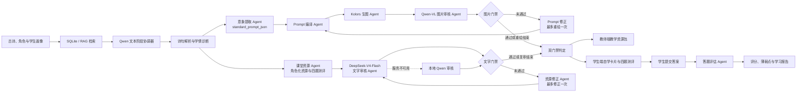

# gpu 多 Agent 学习资源工作流

PoetryEduAgent 将古诗文理解、教学资源生成、意境图生成和质量审核组织为两条相互独立、最终汇合的业务支路。

## 总体流程



## 1. 输入与检索

任务输入由三部分组成：

- 古诗原文与诗词标识；
- 使用角色、年级、能力水平、薄弱点、学习目标和补充要求；
- SQLite 知识库检索出的诗词与教学证据。

RAG 结果会随任务结果保存，便于解释后续生成内容使用了哪些本地证据。

## 2. 文本阶段协调

Qwen2.5-14B-Instruct-AWQ 在一次模型加载中完成多个逻辑职责：

- 学情诊断；
- 诗句解析；
- 角色化学习资源生成；
- 结构化画面描述；
- 两道客观题和两道主观题；
- 本地初审。

这种设计减少单 GPU 环境中的重复模型加载。前端展示的 Agent 是业务职责节点，不代表每个节点都会重新启动一次 Qwen。

## 3. 图像生成支路

意象提取 Agent 输出 `standard_prompt_json`，包含场景、人物、动作、构图、视觉重点、光线、情绪、风格、禁止元素和构图约束。

该 JSON 只进入图像支路：

1. `KolorsPromptCompiler` 将结构化字段编译为中文 Prompt 和负面 Prompt；
2. Kolors 生成单张 `768 × 768` 意境图；
3. Qwen2.5-VL 只依据实际图片报告关键元素；
4. 后端将观察文字解析为确定性审核结果；
5. 若硬约束未通过，Prompt 修正 Agent 根据实际问题重写画面 JSON，并最多重绘一次。

意象提取结果不会作为课堂资源 Agent 的直接输入。

## 4. 教学资源支路

课堂资源 Agent 根据角色生成不同内容：

- 教师端：课堂导入、分层讲解、教学目标、重点难点、问题链和课堂活动；
- 学生端：自学导语、分步讲解、学习目标、思考提示和自主学习活动；
- 两端均生成固定四题测评。

DeepSeek-V4-Flash 独立审核知识准确性、适龄性、教学设计、题目和 rubric。文字审核输入会移除图片 Prompt、图片结果和视觉审核内容，避免两个审核维度相互干扰。

DeepSeek-V4-Flash 调用失败时，工作流进行一次短重试；仍不可用则由本地 Qwen 按同一结构执行文字审核。

文字审核未通过时，资源修正 Agent 会根据 `required_actions` 修订诗句解析、学习资源和测评题，并最多复审一次。文字修正不会改动画面 JSON 或已生成图片。

## 5. 双门禁

最终结论由后端确定性计算：

```text
final_pass = text_pass && vision_pass
```

任务执行完成不等于审核通过。结果会分别保留：

- `text_pass`：文字教学资源是否通过；
- `vision_pass`：意境图是否通过；
- `pass`：两个门禁是否同时通过；
- `failed_parts`：未通过的审核维度；
- `fallback_used`：文字审核是否使用本地 Qwen。

## 6. 学生答题评估

学生提交四道题后：

1. 客观题由确定性规则判定；
2. 主观题连同参考答案和 rubric 交给本地 Qwen；
3. 系统汇总原始得分和百分制得分；
4. 输出逐题反馈、薄弱点、诊断与下一步学习路径；
5. 答案和报告写入 SQLite 运行库。

答题评估在自学卡片生成之后触发，不参与教学资源或图片生成。

## 7. gpu 执行与持久化

- 单张 GPU 同一时刻只执行一个模型阶段；
- Qwen、Kolors 和 Qwen-VL 通过独立子进程运行；
- 任务状态、Agent 事件、结构化结果、图片记录、审核、反馈和测评报告写入运行数据库；
- 图片文件写入 `OUTPUT_DIR`；
- API 重启后可从 SQLite 恢复历史任务。

相关文档：[Agent 状态](AGENT_STATE.md) · [文本阶段](TEXT_STAGE.md) · [模型调度](MODEL_MANAGER.md)
